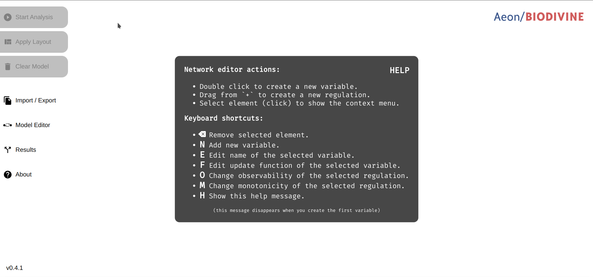
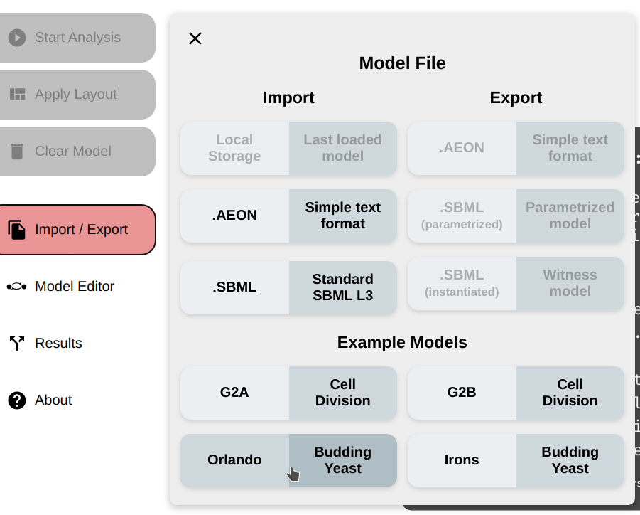
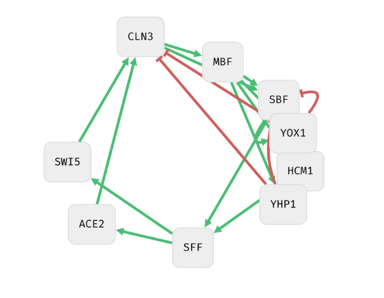
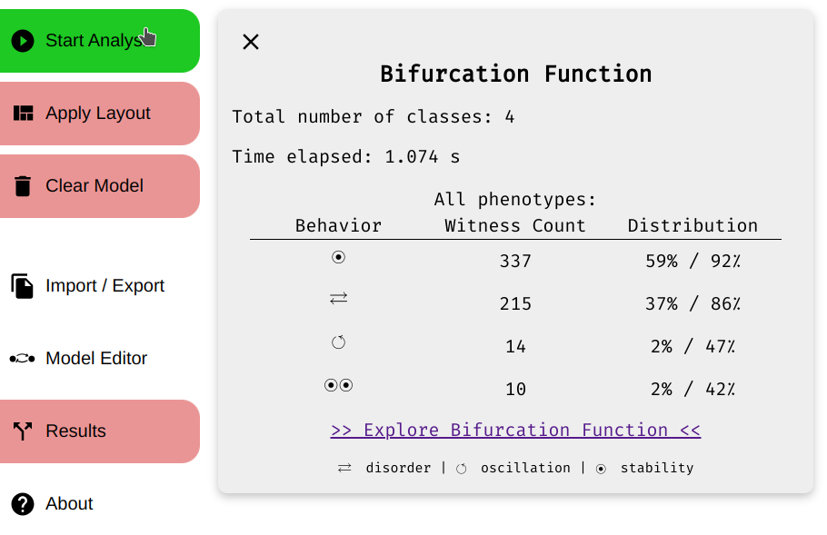
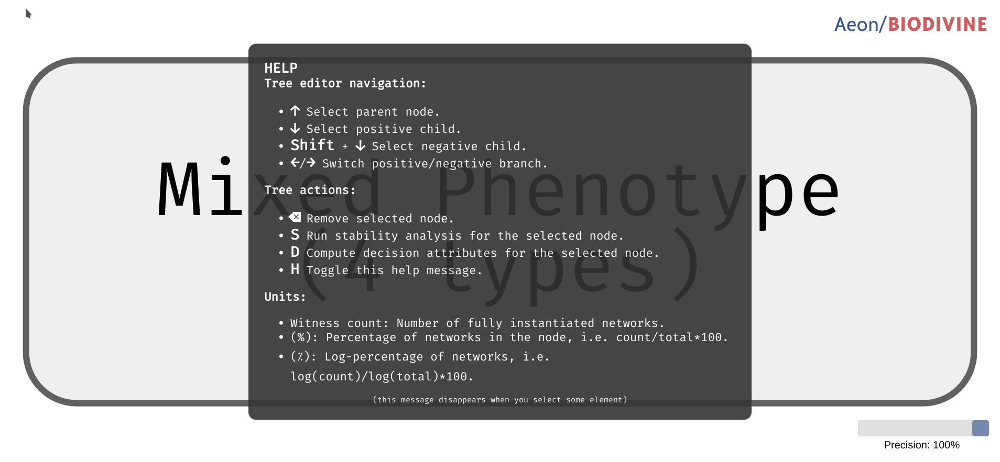
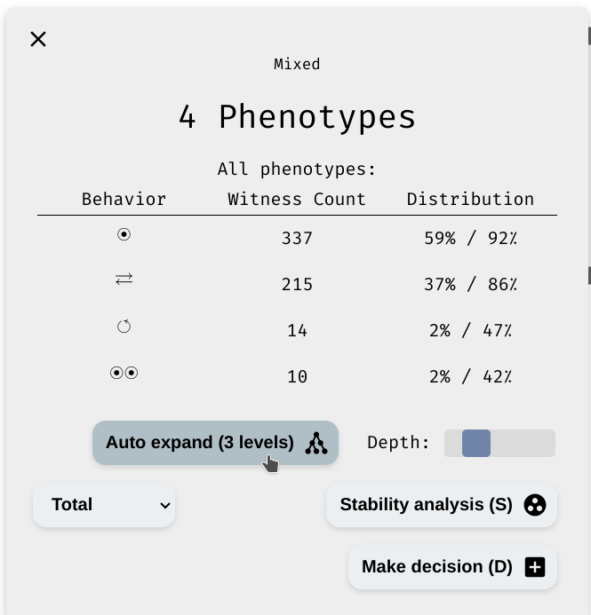
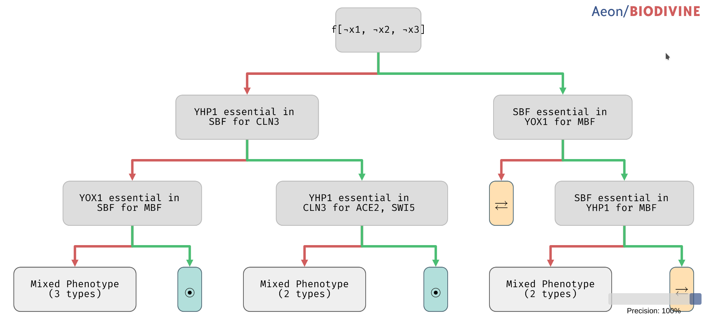

# Biodivine AEON basic usage
This file describes the basic usage of the Biodivine AEON
After starting the project, you will see

To import example model, click **Import / Export**,
Let's say you chose Orlando budding yeast.
 
This is how the model looks like.

## Stability Analysis
To perform stability analysis, click start analysis button. 
Result will be available shortly after.

## Decision Tree Explorer
From the result tab you can explore the decision tree of the model.

Initially, the root node and the Help is displayed. 
Don't worry, the help disappears when you select the node. 
If you want, you can re-show it by *H* key.

To expand the tree, choose the depth and click auto expand.

This is how the tree looks when expanded to three levels.

